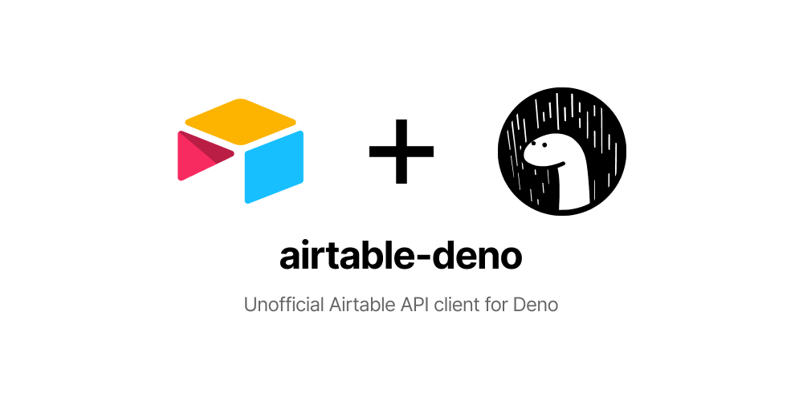

<!-- markdownlint-disable MD033 MD036 MD041 -->

<div align='center'>




</div>

---

- [Imports](#imports)
- [Comparison with Node.js version](#comparison-with-nodejs-version)
- [Permissions](#permissions)
- [Basic examples](#basic-examples)
- [Advanced examples](#advanced-examples)
- [Further reading](#further-reading)
- [Dependencies](#dependencies)
- [License](#license)

---

## Imports

- <https://denopkg.com/grikomsn/airtable-deno/mod.ts>
- <https://griko.dev/airtable-deno.ts>

## Comparison with [Node.js version](https://github.com/Airtable/airtable.js)

- Using built-in Deno `fetch` and [only one dependency](#dependencies)
- First-class support for generic field types with extra field types (`Collaborators`, `MultipleSelect<T>`, etc.)
- Single object instance (`new Airtable()` instead of `new Airtable().base()().select()...`)

## Permissions

- **`--allow-net`**

  Network access for `fetch`ing and requesting datas to Airtable API endpoints.

- **`--allow-env` (optional)**

  Configuring Airtable options via environment variables instead of passing values (see [advanced examples](#advanced-examples)).

## Basic examples

**Instantiate Airtable client**

```ts
import { Airtable } from "https://griko.dev/airtable-deno.ts";

const airtable = new Airtable({
  apiKey: "keyXXXXXXXXXXXXXX",
  baseId: "appXXXXXXXXXXXXXX",
  tableName: "Some table name",
});
```

**Select record(s)**

```ts
const results = await airtable.select();
```

**Creating record(s)**

```ts
const createOne = await airtable.create({
  Name: "Griko Nibras",
  Age: 25,
});

import { Field } from "https://griko.dev/airtable-deno.ts";

type Fields = {
  Name: string;
  Age: number;
  Active?: Field.Checkbox;
};

const createMultiple = await airtable.create<Fields>(
  [
    { Name: "Foo", Age: 20 },
    { Name: "Bar", Age: 15 },
  ],
  { typecast: true }
);
```

**Updating record(s)**

```ts
const updateOne = await airtable.update<Fields>("recXXXXXXXXXXXXXX", {
  Name: "Adult boi",
  Age: 30,
});

const updateMultiple = await airtable.update<Fields>(
  [
    {
      id: "recXXXXXXXXXXXXXX",
      fields: { Name: "Adult boi", Age: 30 },
    },
    {
      id: "recXXXXXXXXXXXXXX",
      fields: { Name: "Yung boi", Age: 15 },
    },
  ],
  { typecast: true }
);
```

**Delete record(s)**

```ts
const deleteOne = await airtable.delete("recXXXXXXXXXXXXXX");

const deleteMultiple = await airtable.delete([
  "recXXXXXXXXXXXXXX",
  "recXXXXXXXXXXXXXX",
]);
```

## Advanced examples

For advanced examples, view the [`examples.ts`](./examples.ts) file.

## Further reading

All options, parameters, errors, and responses are the same as on the [Airtable API documentation](https://airtable.com/api).

## Dependencies

- `querystring`: <https://deno.land/std@0.52.0/node/querystring.ts>

## License

MIT License Copyright (c) 2020 [Griko Nibras](https://github.com/grikomsn)
